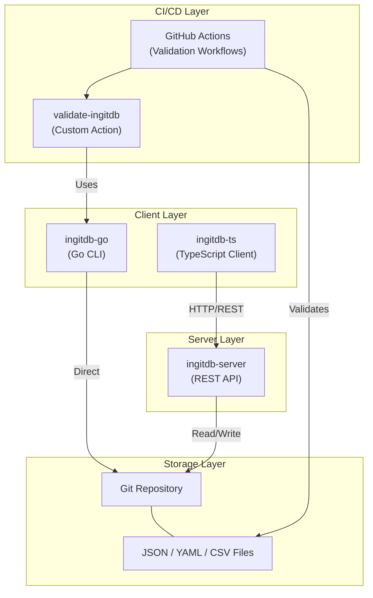
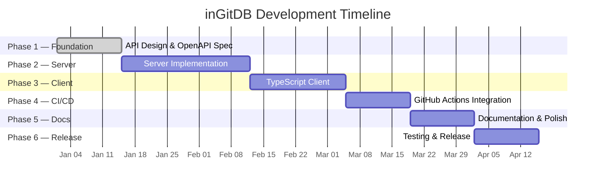
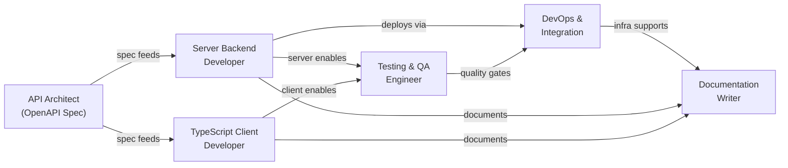

# AGENTS.md — AI Coding Agent Guidelines for inGitDB

> **Single source of truth** for all AI coding agents working on the inGitDB ecosystem.
> Agent-specific configs (CLAUDE.md, .cursorrules, etc.) reference this file.

---

## Project Identity

| Field                         | Value                                                                           |
| ----------------------------- | ------------------------------------------------------------------------------- |
| **Name**                      | inGitDB                                                                         |
| **Description**               | Open-source versioned database for collaboration that stores data in text files |
| **Organization**              | [github.com/ingitdb](https://github.com/ingitdb)                                |
| **License (this repo)**       | CC0 1.0 Universal                                                               |
| **License (implementations)** | MIT                                                                             |
| **Status**                    | Planning & architecture phase                                                   |

This repository (`ingitdb`) is the **main project hub** — planning documents, issue tracking, AI prompts, and architecture specs.
It contains no application source code. Implementation happens in separate repositories (`ingitdb-go`, `ingitdb-ts`, etc.).

---

## Architecture Overview



---

## Repository Map

This is the **main project hub**. Every file is a planning artifact or coordination document:

| Path                                 | Purpose                                                                        |
| ------------------------------------ | ------------------------------------------------------------------------------ |
| `README.md`                          | Project overview, ecosystem repos, navigation, quick start                     |
| `AGENTS.md`                          | This file — AI agent guidelines                                                |
| `CLAUDE.md`                          | Claude Code agent configuration                                                |
| `docs/`                              | All planning and architecture documents                                        |
| `docs/dev-plan/`                     | Skills matrix, 6 AI agents, prompts, 6-phase execution plan, tech stack, risks |
| `docs/openapi-spec.yaml`             | Complete OpenAPI 3.0 specification (25+ endpoints)                             |
| `docs/ingitdb-ts-architecture.md`    | TypeScript client design, fluent API, query builder                            |
| `docs/github-actions-integration.md` | CI/CD workflows, custom actions, validation                                    |
| `docs/summary.md`                    | Status of all deliverables, next steps                                         |
| `ai/prompts/`                        | 10 development task prompts, one per file                                      |
| `LICENSE`                            | CC0 1.0 Universal                                                              |
| `.github/copilot-instructions.md`    | GitHub Copilot agent configuration                                             |
| `.cursor/rules/*.mdc`                | Cursor agent rules                                                             |
| `.windsurfrules`                     | Windsurf agent configuration                                                   |
| `.clinerules/*.md`                   | Cline agent configuration                                                      |

---

## Tech Stack

### Server (`ingitdb-server` — to be created)

- **Runtime**: Node.js 18+ with TypeScript _or_ Go 1.21+
- **Framework**: Express / Fastify (Node) or Gin / Echo (Go)
- **Git library**: nodegit / isomorphic-git (Node) or go-git (Go)
- **Validation**: JSON Schema via `ajv` (Node) or Go validator
- **Auth**: JWT bearer tokens
- **Containerization**: Docker
- **Metadata store**: File-based (JSON/YAML), optional SQLite

### TypeScript Client (`ingitdb-ts` — to be created)

- **Language**: TypeScript 5+
- **Build**: Rollup or tsup (CJS + ESM dual output)
- **Testing**: Jest with ts-jest
- **Linting**: ESLint with TypeScript plugin
- **Formatting**: Prettier
- **Docs**: TypeDoc
- **Publishing**: NPM

### Go CLI (`ingitdb-go` — exists)

- **Language**: Go 1.21+
- **Git**: go-git

### GitHub Actions

- **Custom actions**: TypeScript, Node.js 20
- **Libraries**: @actions/core, @actions/github, @actions/exec
- **CLI**: ingitdb-go binary

---

## Development Plan & Phases



| Phase | Weeks | Focus                      | Lead Agent                    |
| ----- | ----- | -------------------------- | ----------------------------- |
| 1     | 1-2   | API Design & OpenAPI Spec  | API Architect                 |
| 2     | 3-6   | Server Implementation      | Server Backend Developer      |
| 3     | 5-7   | TypeScript Client          | TypeScript Client Developer   |
| 4     | 7-8   | GitHub Actions Integration | DevOps & Integration Engineer |
| 5     | 9-10  | Documentation & Polish     | Documentation Writer          |
| 6     | 11-12 | Testing & Release          | Testing & QA Engineer         |

For full details see the [Development Plan](./docs/dev-plan/#execution-plan).

---

## AI Agent Roles

Six specialized agents are defined in the [Development Plan](./docs/dev-plan/#ai-agents--responsibilities):



| #   | Agent                         | Primary Deliverable                     |
| --- | ----------------------------- | --------------------------------------- |
| 1   | API Architect                 | `openapi.yaml`                          |
| 2   | Server Backend Developer      | `ingitdb-server` implementation         |
| 3   | TypeScript Client Developer   | `ingitdb-ts` NPM package                |
| 4   | Testing & QA Engineer         | Test suites, contract tests, benchmarks |
| 5   | DevOps & Integration Engineer | GitHub Actions workflows, Docker        |
| 6   | Documentation Writer          | User guides, API reference, tutorials   |

---

## Code Conventions

### TypeScript

- Strict mode (`"strict": true` in tsconfig)
- ESLint + Prettier enforced
- Named exports preferred over default exports
- Interfaces over type aliases for object shapes
- Async/await over raw Promises
- Explicit return types on public functions
- JSDoc on all public APIs

### Go

- Follow [Effective Go](https://go.dev/doc/effective_go) and `gofmt`
- Error wrapping with `fmt.Errorf("context: %w", err)`
- Table-driven tests
- `golint` / `staticcheck` clean

### YAML (OpenAPI)

- 2-space indentation
- Comments for non-obvious design decisions
- `$ref` for reusable schemas — avoid inline duplication
- Keep endpoint paths RESTful and consistent

### Markdown

- ATX-style headers (`#`, not underline)
- One sentence per line (for clean diffs)
- Reference links at bottom of document when there are many
- Mermaid diagrams for architecture and flow visualization
- Tables for structured comparisons

### General

- UTF-8 encoding, LF line endings
- Files end with a single newline
- No trailing whitespace
- Maximum line length: 120 characters (soft limit)

---

## File & Folder Structure

Expected layout for implementation repositories:

```
ingitdb-server/
  src/
    routes/          # Express/Fastify route handlers
    services/        # Business logic
    models/          # Data models and schemas
    middleware/       # Auth, validation, error handling
    utils/           # Shared utilities
  tests/
    unit/
    integration/
  docker/
    Dockerfile
    docker-compose.yaml
  openapi.yaml       # Copied/symlinked from ingitdb
  package.json
  tsconfig.json

ingitdb-ts/
  src/
    client/          # Main InGitDB client class
    resources/       # Database, Table, Record, Branch, Commit classes
    query/           # Query builder
    http/            # HTTP client with retry logic
    generated/       # Auto-generated from OpenAPI spec
    errors/          # Custom error classes
    types/           # TypeScript type definitions
  tests/
    unit/
    integration/
    contract/
  package.json
  tsconfig.json
  rollup.config.js
```

---

## Git Workflow

### Branching Strategy

- `main` — stable, always deployable
- `develop` — integration branch for next release
- `feature/<name>` — new features
- `fix/<name>` — bug fixes
- `docs/<name>` — documentation changes
- `chore/<name>` — maintenance tasks

### Branch Naming

Format: `<type>/<short-description>`

Examples: `feature/record-pagination`, `fix/merge-conflict-handling`, `docs/api-reference`

---

## Commit & PR Conventions

### Conventional Commits

Format: `<type>(<scope>): <description>`

| Type       | Usage                                                   |
| ---------- | ------------------------------------------------------- |
| `feat`     | New feature                                             |
| `fix`      | Bug fix                                                 |
| `docs`     | Documentation only                                      |
| `style`    | Formatting, no code change                              |
| `refactor` | Code change that neither fixes a bug nor adds a feature |
| `test`     | Adding or correcting tests                              |
| `chore`    | Build process, CI, tooling                              |
| `perf`     | Performance improvement                                 |

**Scope examples**: `api`, `server`, `client`, `actions`, `docs`

### PR Requirements

- Descriptive title following Conventional Commits format
- Summary of changes with context
- Link to related issue(s)
- Test plan or evidence of testing
- Breaking changes clearly noted

---

## Testing Requirements

### Coverage Targets

| Component         | Minimum Coverage                    |
| ----------------- | ----------------------------------- |
| Server            | 80%                                 |
| TypeScript Client | 80%                                 |
| GitHub Actions    | Integration tests for all workflows |

### Testing Tools

| Tool         | Purpose                                        |
| ------------ | ---------------------------------------------- |
| Jest         | TypeScript/JavaScript unit & integration tests |
| Go `testing` | Go unit tests                                  |
| Pact         | Consumer-driven contract tests                 |
| Artillery    | Load and performance testing                   |
| MSW          | Mock Service Worker for client tests           |

### Test Naming

- `describe('ClassName')` / `describe('functionName')`
- `it('should <expected behavior> when <condition>')`
- Test files: `*.test.ts`, `*.spec.ts`, or `*_test.go`

---

## Quality Metrics & Performance Targets

From the [Development Plan](./docs/dev-plan/#success-metrics):

### Performance

| Metric               | Target      |
| -------------------- | ----------- |
| API response (p95)   | < 100 ms    |
| Concurrent users     | 1,000+      |
| Records per database | 10,000+     |
| Git operations       | < 5 seconds |

### Quality

| Metric                            | Target |
| --------------------------------- | ------ |
| Test coverage                     | 80%+   |
| Critical security vulnerabilities | 0      |
| API uptime                        | 99.9%  |
| Documentation coverage            | 100%   |

---

## Key Technical Decisions

| Decision                         | Rationale                                                           |
| -------------------------------- | ------------------------------------------------------------------- |
| **Git as storage engine**        | Native versioning, branching, merging — core differentiator         |
| **OpenAPI-first design**         | Contract-driven; generate server stubs and client SDKs              |
| **JWT authentication**           | Stateless, scalable, industry standard                              |
| **JSON + YAML storage**          | Human-readable, Git-diffable, widely supported                      |
| **Text-file format**             | Enables GitHub Actions validation via CLI without server            |
| **Separate repos per component** | Independent release cycles, clear ownership                         |
| **TypeScript for client**        | Largest ecosystem for API consumers                                 |
| **Go for CLI**                   | Fast compilation, single binary distribution, existing `ingitdb-go` |

---

## Document References

All detailed specifications live in this repository:

| Document                                                                     | What to Find There                                         |
| ---------------------------------------------------------------------------- | ---------------------------------------------------------- |
| [`docs/dev-plan/`](./docs/dev-plan/)                                         | Agent roles, prompts, execution plan, skills matrix, risks |
| [`docs/openapi-spec.yaml`](./docs/openapi-spec.yaml)                         | Complete API contract — endpoints, schemas, auth           |
| [`docs/ingitdb-ts-architecture.md`](./docs/ingitdb-ts-architecture.md)       | Client design, fluent API, query builder, error handling   |
| [`docs/github-actions-integration.md`](./docs/github-actions-integration.md) | CI/CD workflows, custom actions, validation rules          |
| [`docs/summary.md`](./docs/summary.md)                                       | Deliverable status, next steps, statistics                 |
| [`ai/prompts/`](./ai/prompts/)                                               | 10 development task prompts                                |
| [`README.md`](./README.md)                                                   | Project overview, architecture diagram, quick start        |

### External Links

- [inGitDB Organization](https://github.com/ingitdb)
- [ingitdb-go CLI](https://github.com/ingitdb/ingitdb-go)
- [inGitDB Documentation Site](https://ingitdb.github.io/)

---

## Rules for Editing This Repository

Since this is the **main project hub** (no application code):

1. **Do not create source code files** (`.ts`, `.go`, `.js`) — those belong in implementation repos
2. **Do not modify `docs/openapi-spec.yaml`** unless explicitly instructed — it is a versioned contract
3. **Preserve existing document structure** — add sections, don't reorganize
4. **Use relative links** between documents in this repo
5. **Keep Mermaid diagrams** up to date when architecture changes
6. **Update `docs/summary.md`** when adding new deliverables
7. **Reference, don't duplicate** — point to existing docs rather than copying content
